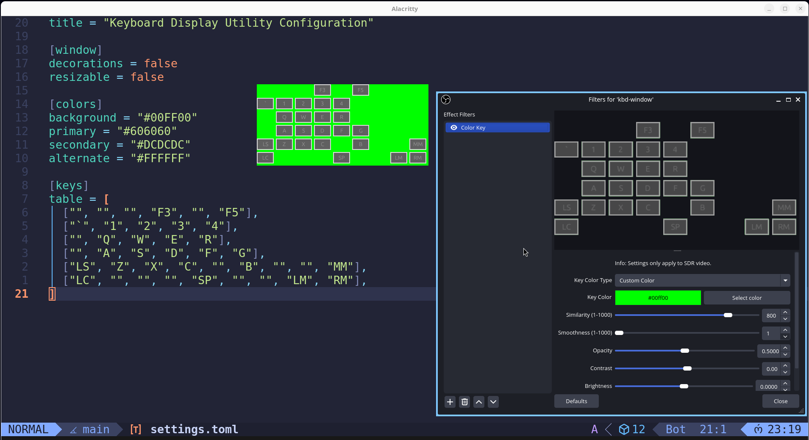

# Keyboard Display Utility

Tool for displaying computer inputs, written in Rust with [`egui`](https://crates.io/crates/inputbot) and [`inputbot`](https://crates.io/crates/egui): intended for streaming/recording.

## Screenshot

## Usage

The contents of `settings.toml` will define what your window looks like. Most importantly, `keys.table` will define what keys are read, and what the layout looks like: the app is built in a grid layout based upon this table. For string key codes to use, look at the case matching in `src/map.rs` (note that empty strings act as grid spacing). Window size is auto-calculated based on the size of your table.

## Building and Running

Generally at its base, this is a normal Rust project where you can simply `cargo build`.

However, because of permissions complexity of key reading (fair enough, keyloggers can be bad) there is a little harder of a task to run it. Specifically for my own personal machine, which is running Debian 13 Trixie, I can run it fine with the following:

`sudo -E ./target/release/keyboard-display-utility`

This is because `inputbot` needs `sudo` level permission (for the key reading), but then displays of the current user are not available to the sudo user for `egui` to use, so `-E` provides display usage. Please note that this is simply my understanding of things, so this explanation may be incomplete, but regardless: it works for me. I use the included `run.sh` to do this a bit more streamlined.

## Credits

Written by benjamin.w.massey@gmail.com
